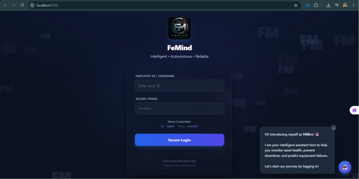
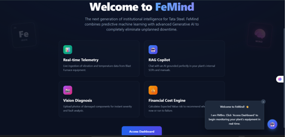
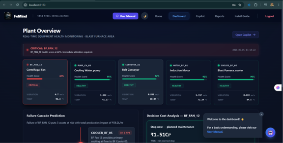
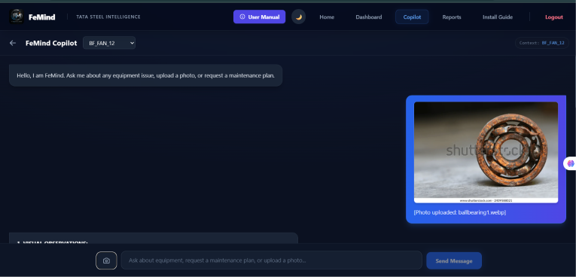
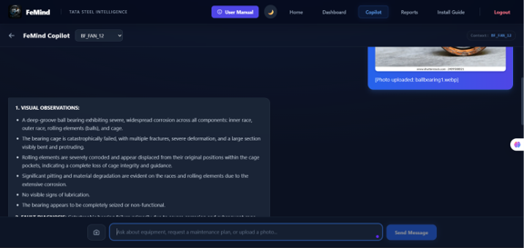
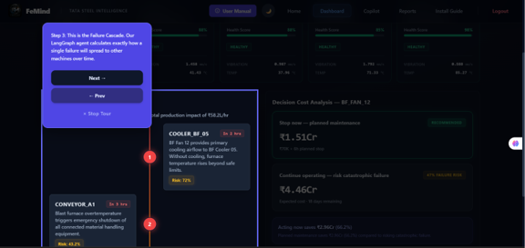
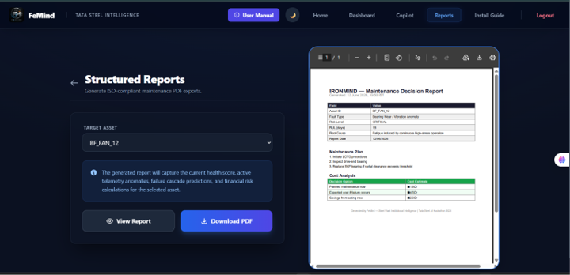
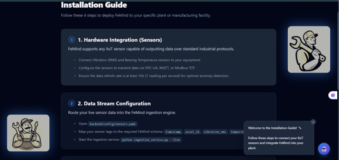

# 🚀 FeMind: Agentic AI Command Center for Predictive Maintenance


## 📌 Overview
In modern heavy industries like steel manufacturing, traditional threshold-based alerts are not enough. When critical machinery (like a Blast Furnace Fan) vibrates abnormally, engineers don't just need an alert—they need to know the root cause, the cascading impact on other machines, the repair procedure, and the financial cost of failure.

**FeMind** replaces static alerts with a fully autonomous, **Multi-Agent AI Command Center**. It ingests live multivariate SCADA sensor data, detects anomalies in real-time using Machine Learning, and deploys specialized AI Agents to diagnose, evaluate, and plan maintenance operations.



---

## 🌟 Key Features

### 1. 🔍 Real-Time Anomaly Detection & RUL Prediction
- **IsolationForest:** Continuously monitors live multivariate sensor streams (vibration, temperature, pressure, rpm) to detect subtle anomalies before they become critical.
- **XGBoost:** Dynamically predicts the Remaining Useful Life (RUL) of degrading assets in real-time.
- 

### 2. 📉 Failure Cascade Graph AI
- Uses `NetworkX` graph algorithms to mathematically predict the "blast radius" of a failure.
- When an anomaly is detected, the Cascade Agent maps exactly which downstream conveyor belts or induction motors will be forced to shut down next.
- 

### 3. 💰 ROI Cost Engine
- Engineering decisions are business decisions. The Cost Engine dynamically calculates the exact Expected Financial Value.
- It proves the ROI of maintenance by showing the exact Rupees saved by stopping production for planned maintenance today versus risking a catastrophic run-to-failure tomorrow.
- 

### 4. 🤖 Agentic RAG Copilot (Gemini & LangGraph)
- Powered by `LangGraph` and `Gemini 2.5 Flash`, grounded securely on internal ISO manuals and SOPs using a `ChromaDB` vector store.
- Engineers can query the copilot for step-by-step repair procedures specific to the exact machine and fault type.
- 

### 5. 📸 Visual AI Diagnosis
- Upload a photo of a broken part or anomalous gauge.
- The Vision Agent instantly processes the image and diagnoses physical wear-and-tear or damage.
- 

### 6. 📄 Automated ISO PDF Reporting
- Eliminates paperwork by autonomously compiling sensor data, financial risk, and AI maintenance plans into structured, downloadable PDF reports.
- 

---

## 🛠 Tech Stack



- **Frontend:** React, Vite, Tailwind CSS, Lucide React, Recharts
- **Backend:** FastAPI, Python, Uvicorn, SQLAlchemy
- **AI / LLM:** Google Gemini 2.5 Flash, LangGraph, LangChain
- **Machine Learning:** XGBoost, Scikit-Learn (IsolationForest)
- **Vector Database:** ChromaDB
- **Reporting:** ReportLab

---

## 📂 Directory Structure

```text
FeMind/
├── backend/
│   ├── agents/             # LangGraph AI Agents (Diagnosis, Cascade, Planner)
│   ├── data/               # SCADA Data simulation and ingestion
│   ├── db/                 # SQLite database models
│   ├── models/             # XGBoost (RUL) & IsolationForest (Anomaly) Models
│   ├── rag/                # ChromaDB Vector Store & Document Loader
│   ├── utils/              # PDF Generator and utility scripts
│   ├── main.py             # FastAPI entry point
│   ├── requirements.txt    # Backend dependencies
│   └── .env                # API Keys (Ignored in Git)
├── frontend/
│   ├── src/
│   │   ├── components/     # React UI Components
│   │   ├── App.jsx         # Main React application
│   │   ├── index.css       # Global styles (Tailwind)
│   │   └── main.jsx        # React entry point
│   ├── index.html
│   ├── package.json
│   └── vite.config.js
├── local_deploy.py         # Unified deployment wrapper
└── README.md
```

---

## ⚙️ Installation & Setup (Local Deployment)

FeMind is heavily optimized for easy deployment. The React frontend is pre-built and packaged with the FastAPI backend, meaning you do not need Node.js installed to run the production build.

### Prerequisites:
- Python 3.10+


### Step-by-Step:
1. Clone the repository:
   ```bash
   git clone https://github.com/YOUR_USERNAME/FeMind.git
   cd FeMind
   ```


2. Install the dependencies:
   ```bash
   pip install -r backend/requirements.txt
   ```

3. Launch the entire application (Frontend + Backend):
   ```bash
   python local_deploy.py
   ```

4. Open your web browser and navigate to:
   **http://localhost:8000**
